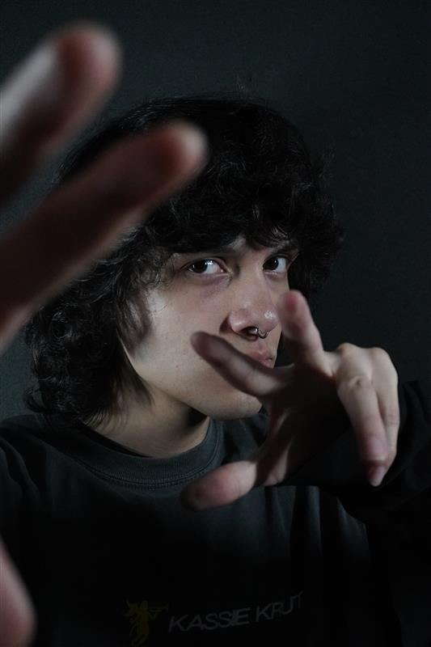

# Gaël Gutierrez

>Une photo de moi à plan moyen, qui a été réalisée pendant la session d'automne 2025.

## **Intérêts dans le multimedia**
Personnellement, je me suis inscrit en multimédia car la création d'art est une de mes motivations les plus importantes dans la vie. J'étais déjà un artiste multidisciplinaire depuis mon enfance, je crée de la musique de style jeu-vidéo et je réalise des illustrations numériques dans mon temps libre. Le domaine de la sonorisation, surtout de la composition, est celui qui m'intéresse le plus professionnellement.

Un artiste qui m'inspire grandement est Toby Fox, un musicien et un développeur de jeux-vidéos indépendants. Il m'inspire car il arrive à réaliser des projets de qualité comparable à des grands studios principallement par lui-même. 
Son jeu Undertale, sorti en 2015, a connu un succès massif.

https://fr.wikipedia.org/wiki/Undertale

